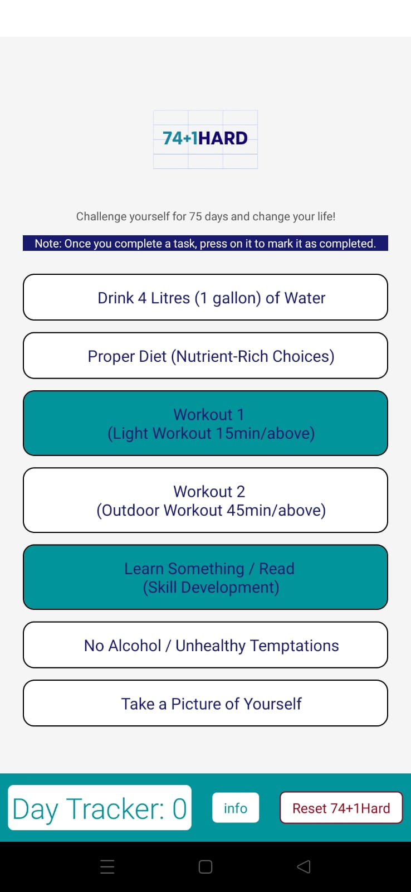

# 74+1 HARD Challenge - Mobile Application

The 74+1 HARD Challenge mobile application is a comprehensive fitness challenge designed to enhance your physical and mental endurance. Embrace the challenge and embark on a transformative journey to elevate your fitness levels and foster a healthy lifestyle. This app empowers you to push your boundaries and achieve your fitness goals while keeping track of your progress in real-time.

## Features

- **74+1 HARD Challenge:** Experience an immersive fitness challenge consisting of a series of exercises and activities tailored to elevate your endurance.

- **Progress Tracking:** Easily monitor your daily activities, workouts, and milestones to keep a close eye on your fitness journey.

## Note

The 74+1 HARD Challenge app is intended for recreational fitness challenges and healthy lifestyle pursuits. It is not a substitute for professional medical advice or treatment. Consult with a healthcare professional before starting any new fitness program.

---
*Disclaimer: The 74+1 HARD Challenge app is designed for recreational fitness challenges. Please use the app responsibly and consult with a healthcare professional if you have any health concerns.*
